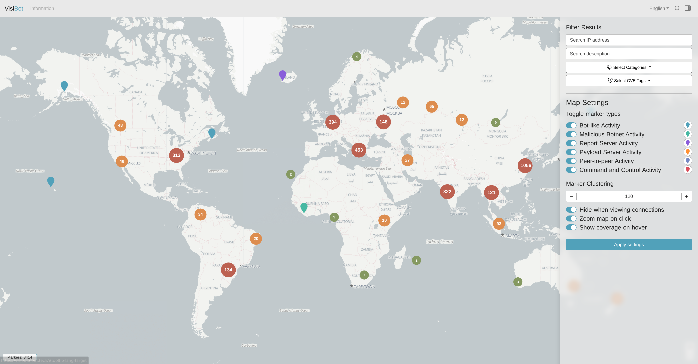

# VisiBot - Automated Detection of IoT Botnets

- **Level 4 Individual Project** - [SoCS - University of Glasgow](https://www.gla.ac.uk/schools/computing/)

- **Author**: [Daniel Arthur (2086380a)](mailto:2086380a@student.gla.ac.uk)

- **Supervisor**: [Angelos Marnerides](mailto:angelos.marnerides@glasgow.ac.uk)

## Installation Instructions and Timelog
- Please refer to [MANUAL.md](/MANUAL.md) for setup/installation instructions.
- Please refer to [TIMELOG.md](/TIMELOG.md) for a full time-log of activity throughout development.

# Project Outline

VisiBot is an automated IoT botnet detection system used for real-time identification  and visualisation of Internet of Things (IoT) Botnets.

## VisiBot Processing System

The VisIBot Processing System automatically collects Bad Packets honeypot data and extracts, executes and analyses botnet malware payloads using the LiSa sandbox in real-time. Through combined static and dynamic analysis of malware payloads, the proposed system is capable of identifying potential (candidate) Command & Control (C2) servers and Peer-to-Peer networks for IoT Botnets. Contained in various docker images, celery tasks are created from collected Bad Packets results and are processed using a scalable number of celery workers. The task queue is maintained using redis and is designed to work with various celery workers. This ensures that even if a single worker fails, the task queue will not be halted and processing will continue.

### Tools and Frameworks:
- [Python](https://www.python.org/) - Interpreted, high-level programming language
- [Celery](https://docs.celeryproject.org/en/stable/getting-started/introduction.html) - Python-based distributable task queueing system
- [Flower](https://flower.readthedocs.io/en/latest/) - Celery Monitoring Tool
- [Redis](https://redis.io/) - In-memory data store used as a broker for Celery
- [Docker](https://www.docker.com/) - Platform and container service

### Services
- [Bad Packets](https://badpackets.net/) - Cyber-threat Intelligence honeypot service
- [VirusTotal](https://www.virustotal.com/) - Anti-virus vendor aggregation
- [MaxMind GeoIP2](https://www.maxmind.com/en/geoip2-databases) - Locally maintained databases for IP geographic information
- [IPInfo](https://ipinfo.io/) - IP address data API service

## VisiBot Web Application

The VisiBot web-application is a browser-based visualisation tool that maps geo-location of identified potential bots, payload servers, peer-to-peer nodes and command-and-control servers. Written in Nuxt.js and hosted using Express.js, the main service uses Leaflet.js to cluster and annotate the geo-locations of any identified botnet activity.

### Tools and Frameworks:
- [NodeJS](https://nodejs.org/en/) - JavaScript runtime
- [Nuxt.js](https://nuxtjs.org/) - Frontend JavaScript Framework
- [Express.js](https://expressjs.com/) - Backend Web Server for Node.js
- [Mongoose](https://mongoosejs.com/docs/) - MongoDB object modelling framework for Node.js
- [Leaflet.js](https://leafletjs.com/) - JavaScript library for interactive maps
- [BootstrapVue](https://bootstrap-vue.org/) - Bootstrap CSS/JS Framework vue integration

## LiSa Sandbox
[LiSa](https://github.com/danieluhricek/LiSa) is a Linux Sandbox project created by [Daniel Uhříček](https://github.com/danieluhricek) which provides automated Linux malware analysis on various CPU architectures. I have modified this project ([AVAILABLE HERE](https://github.com/denBot/LiSa)) to allow for the following additional features:
- Ability to create analysis tasks by submitting a malware URL instead of uploading a file
- Added binary unpacking for any binaries packed using the UPX packer software
- Added ability to provide external service API endpoints. POST requests are made to these endpoints when a given task fails/succeeds.

